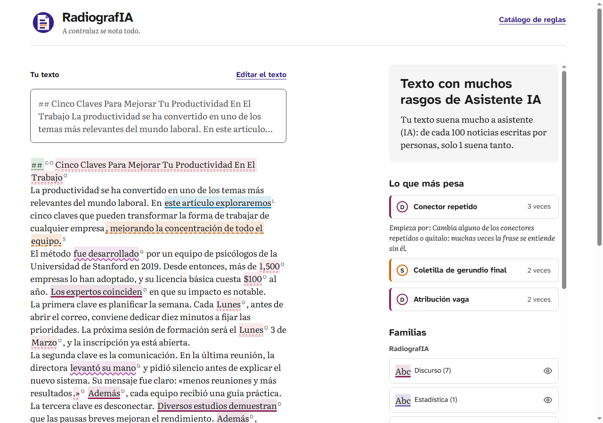
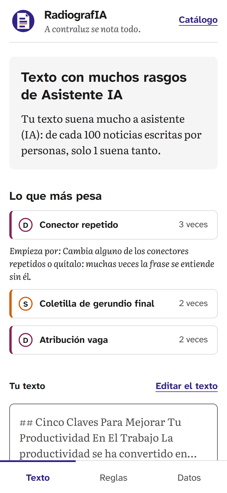
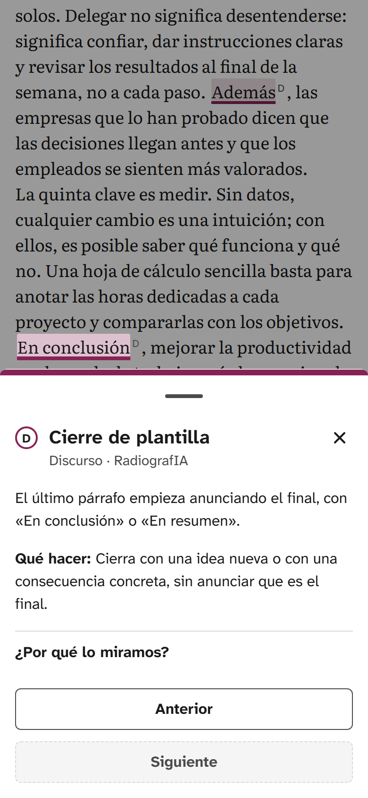
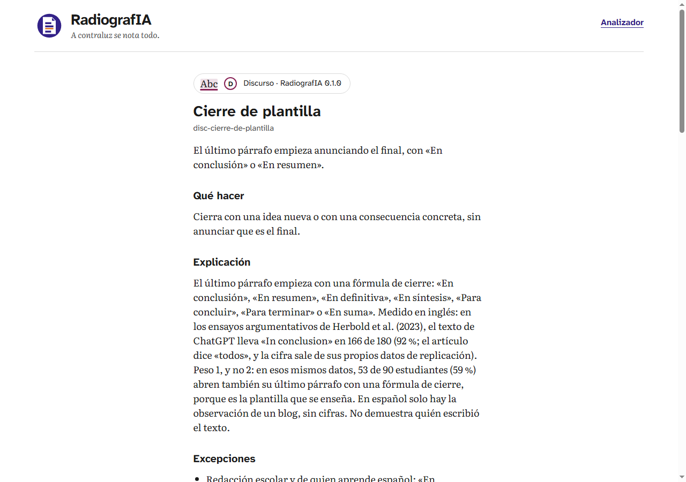
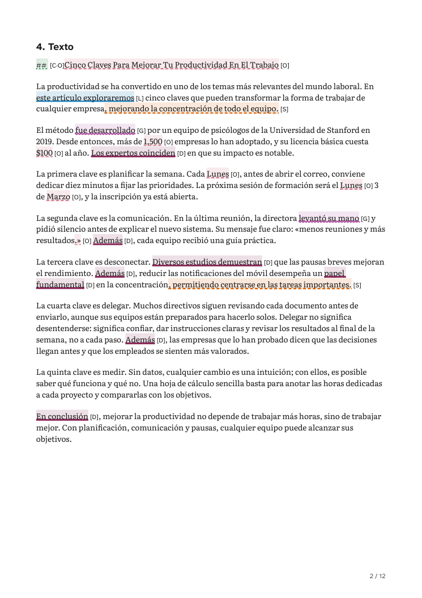

<div align="center">


# RadiografIA

**A contraluz se nota todo.**

[](#estado-y-nevera)
[](LICENSE)
[](https://astro.build/)
[](https://www.typescriptlang.org/)
[](#cómo-está-hecho)
[](https://radiografia.antonioblanquez.es)

**50 reglas · 2 paquetes · 6 géneros calibrados · 54 páginas · nada sale del navegador**

</div>

<div align="center">

### 🩻 Probarlo → **[radiografia.antonioblanquez.es](https://radiografia.antonioblanquez.es)**

</div>

> **Analiza estilo. No demuestra autoría.** Pegas un texto en español y
> RadiografIA señala los rasgos que, según sus fuentes, los asistentes de
> chat dejan más que las personas: fórmulas, formato pegado, puntuación,
> vocabulario y ritmo. Lo compara con textos escritos por personas, del
> mismo tipo y de la misma longitud, y dice a qué suena. Nunca quién lo
> escribió.
>
> **Para probarlo en un minuto:** pulsa «Texto de IA» o «Texto humano» y
> después «Pon tu texto a contraluz». Las reglas, una por una y con sus
> fuentes, están en el
> **[catálogo](https://radiografia.antonioblanquez.es/reglas/)**.
>
> Para levantarlo en tu máquina →
> [**Cómo ejecutarlo y probarlo**](#cómo-ejecutarlo-y-probarlo).

---

## Qué hace

1. **Pegas un texto en español**, o cargas uno de los dos de ejemplo, y
   eliges su género: general, noticia, administrativo, narrativa clásica,
   académico u opinión (críticas de cine).
2. **Pulsas «Pon tu texto a contraluz»** y sale una etiqueta con una frase
   en claro: cómo suena tu texto al lado de textos escritos por personas,
   del mismo género y de su misma longitud. Por ejemplo: «Tu texto suena
   mucho a asistente (IA): de cada 100 noticias escritas por personas,
   solo 1 suena tanto».
3. **Debajo, el texto con sus tramos marcados por familia**, cada una con
   su tinte, su estilo de línea y su sigla. Al tocar un tramo, la regla en
   una frase llana y qué hacer.
4. **«Descargar informe» genera el PDF en el navegador** y lo descarga,
   también en el iPhone y en el iPad.
5. **Todo corre en tu navegador.** El servidor solo sirve ficheros: no hay
   backend que analice, ni cuentas, ni cookies. Ni el texto ni los
   paquetes que cargues salen de él.

<div align="center">

<br><em>El texto de prueba de los jueces, escrito a propósito con estilo de asistente y calcos de traducción, analizado como «Noticia» en la web publicada. <strong>La etiqueta habla de su estilo, no de quién lo escribió</strong>: lo compara con noticias de su longitud escritas por personas.</em>
</div>

---

## Qué no demuestra, y por qué

- **No es un detector de autoría.** Las reglas miden rasgos de estilo. Una
  persona puede tenerlos, y un texto de asistente puede no tenerlos. Por
  eso la frase dice «suena a», y nunca quién escribió el texto. Los dos
  textos de ejemplo lo enseñan con «Opinión (críticas de cine)». El que
  generó Claude Opus 5.5 el 02/10/2026, sin ninguna instrucción de estilo,
  sale «Texto con muy pocos rasgos que indiquen que tiene Asistente IA». El
  de Antonio, el autor del proyecto, sale «Dentro de lo normal». Sus
  cifras, regla a regla, en [`docs/ejemplos.md`](docs/ejemplos.md), con un
  juez que las vigila.
- **No da porcentajes de «IA».** «De cada 100 noticias escritas por
  personas, solo 1 suena tanto» cuenta textos de personas. No es la
  probabilidad de que el tuyo lo haya escrito una máquina.
- **Compara con personas, no con máquinas.** Las reglas estadísticas
  comparan tu texto con los percentiles de textos de personas de su género
  y su longitud, nunca con un umbral fijo. Se validaron con textos de
  personas que se apartaron antes de medir: en el 2,1 % (35 de 1.703)
  saltan dos o más de ellas. Por género, va del 1,1 % de opinión al 5,1 %
  (5 de 98) de administrativo. El plan pedía no pasar del 5 %, y Antonio aceptó
  administrativo con declaración el 01/10/2026.
- **Sin cifras de acierto.** Cuántos textos de asistente reconoce y
  cuántos se le escapan no está medido. Haría falta un corpus de textos de
  asistente medido con el mismo cuidado, y quedó fuera de la v1 el
  29/09/2026 ([PLAN, «Fuera de la v1»](PLAN-RADIOGRAFIA.md#fuera-de-la-v1-fase-2--no-se-toca-sin-abrir-el-plan)).
  Sin él, una cifra de acierto sería inventada.
- **Sus límites:**
  - con menos de 100 palabras de prosa no analiza; de 100 a 299, el
    resultado es orientativo; desde 300, completo;
  - hay seis géneros calibrados, y no en todas las longitudes: narrativa
    clásica y académico no tienen textos de personas de 100 a 299 palabras
    con los que comparar, y ahí dice «No podemos comparar»;
  - cuatro de los cinco corpus son de España: la prensa de la agencia EFE
    y de El Periódico, el BOE, el CSIC y las críticas de MuchoCine. La
    narrativa clásica es de Project Gutenberg. Las columnas y los blogs de
    hoy, la narrativa contemporánea, el lenguaje corporativo y la variedad
    americana no tienen corpus abierto con licencia, y no están calibrados
    ([ESTADO, «Nevera»](RADIOGRAFIA-ESTADO.md#nevera)).

---

## Capturas

### En el móvil

<table>
  <tr>
    <td width="50%">
      
      <p align="center"><em>Arriba, la etiqueta y su frase; debajo, <strong>lo que más pesa</strong> y por dónde empezar. Las cifras van plegadas. A 390 px, el texto, las reglas y los datos son pestañas.</em></p>
    </td>
    <td width="50%">
      
      <p align="center"><em>Al tocar un tramo, la hoja de abajo: la regla en una frase llana, <strong>qué hacer</strong> y, plegado, «¿Por qué lo miramos?».</em></p>
    </td>
  </tr>
</table>

### El catálogo y el informe

<table>
  <tr>
    <td width="50%">
      
      <p align="center"><em><a href="https://radiografia.antonioblanquez.es/reglas/disc-cierre-de-plantilla/">Cada regla tiene su página</a>: su frase en claro, qué hacer, la explicación con sus fuentes, las excepciones y los ejemplos.</em></p>
    </td>
    <td width="50%">
      
      <p align="center"><em>La página 2 del PDF: el texto con sus subrayados y, detrás de cada uno, <strong>la sigla de su familia</strong>, para leerlo sin color.</em></p>
    </td>
  </tr>
</table>

Las cinco son de la web publicada, del 06/10/2026. Cómo se hicieron, en
[`docs/capturas/PROCEDENCIA.md`](docs/capturas/PROCEDENCIA.md).

---

## Cómo está hecho

- **Un motor de reglas que no sabe nada de «IA».** Aplica paquetes de
  reglas en JSON, validados al cargar con un esquema (JSON Schema 2020-12)
  que dice qué regla y qué campo fallan. Hay tres tipos de detector: de
  patrón, estructural y estadístico. Está en [`motor/`](motor/), en
  TypeScript que Node ejecuta sin compilar.
- **Dos paquetes incluidos.** **RadiografIA**, 43 reglas en seis familias:
  léxico, sintaxis, puntuación y formato, estadística, discurso y canal.
  **Español correcto**, 7 avisos de norma de la RAE que suelen delatar un
  calco del inglés o una traducción. Cada regla lleva su nivel de
  evidencia y sus fuentes (abajo,
  [«Reglas y evidencia»](#reglas-y-evidencia)).
- **Calibrado con textos de personas** de cinco corpus, uno por género:
  AnCora (noticia), el BOE (administrativo), Project Gutenberg (narrativa
  clásica), el CSIC (académico) y MuchoCine (opinión). El sexto, «general»,
  los mezcla. Los textos no están en el repositorio: solo sus cifras y sus
  manifiestos, sin texto. La licencia de cada corpus y la atribución que
  pide, en la página
  [«Créditos y licencias»](https://radiografia.antonioblanquez.es/creditos/).
- **Una web estática en Astro 7**, sin backend: el analizador, el catálogo
  con una página por regla, los créditos y la página que no existe. Las
  fuentes, Literata y Atkinson Hyperlegible Next, se sirven desde la propia
  web, sin pedir nada a Google Fonts.
- **El PDF se hace en el navegador**, con pdfmake, en un trozo de JS aparte
  que solo se pide al pulsar «Descargar informe»: unos 1,09 MB; unos 363 KB
  con gzip.
- **Publicada en Hostinger** desde una rama aparte, `publicacion`, que
  lleva solo `web/dist/` y su `.htaccess`, con la política de seguridad
  (CSP) también por cabecera.

```text
motor/      el motor: TypeScript sin compilar, sus jueces y las herramientas de calibración
web/        la web estática en Astro: el analizador, el catálogo, los créditos, sus jueces y la publicación
paquetes/   los dos paquetes de reglas incluidos
data/       los datos de terceros y la calibración, cada carpeta con su licencia
docs/       la investigación, el detalle de la web, la calibración, el despliegue, el acta, el censo y la bitácora
```

**El detalle vive al lado:**

- [`docs/WEB.md`](docs/WEB.md): cómo se lee el resultado, el catálogo, el
  informe, el diseño, los dos paquetes, el cargador y las decisiones de
  fondo.
- [`docs/CALIBRACION.md`](docs/CALIBRACION.md): los corpus, cómo se
  reproduce la calibración, la validación con sus tablas y la escala.
- [`docs/ARRANQUE-LOCAL.md`](docs/ARRANQUE-LOCAL.md): arrancarlo en local,
  con el porqué de cada paso.
- [`docs/DESPLIEGUE.md`](docs/DESPLIEGUE.md): lo que viaja al navegador,
  con sus tamaños, y cómo se publica.
- [`DISEÑO-RADIOGRAFIA.md`](DISEÑO-RADIOGRAFIA.md): la paleta, la
  tipografía, las pantallas y el informe.
- [`docs/acta-contraste-y-accesibilidad.md`](docs/acta-contraste-y-accesibilidad.md):
  el contraste y la accesibilidad, medidos.
- [`docs/CENSO-PRE-DESPLIEGUE.md`](docs/CENSO-PRE-DESPLIEGUE.md): el censo
  antes de publicar y lo medido en producción.
- [`docs/investigacion/`](docs/investigacion/): la investigación de cada
  familia, hecha antes de escribir su primera regla.
- [`PLAN-RADIOGRAFIA.md`](PLAN-RADIOGRAFIA.md) y
  [`RADIOGRAFIA-ESTADO.md`](RADIOGRAFIA-ESTADO.md): el plan por puntos y el
  estado.
- [`docs/BITACORA.md`](docs/BITACORA.md): los fallos reales, con lo que
  daba verde mientras estaban vivos.
- [`docs/CRONICA-DE-CONSTRUCCION.md`](docs/CRONICA-DE-CONSTRUCCION.md): la
  sección «Estado» que tuvo este README hasta el 06/10/2026, tal cual.

---

## Cómo ejecutarlo y probarlo

Hace falta **[Node](https://nodejs.org/) 24.12 o posterior** (el
repositorio lo declara en `engines`) y, para los jueces que abren la
página, **Chrome** instalado. Si no está en su ruta de siempre, se le da
con la variable `CHROME`.

```bash
git clone https://github.com/ablanquez/radiografia.git
cd radiografia
npm ci          # en la raíz: instala los dos workspaces, motor/ y web/
cd web
npm run dev     # http://localhost:4321/, y el catálogo en /reglas/
```

- `npm run build` y `npm run preview`, en `web/`: la versión construida.
- `npm test`, en la raíz: los jueces del motor y los de la web.
- `npm run tipos`, en la raíz: los tipos de los dos workspaces, con `tsc`.

La telemetría de Astro, el `--force` después de tocar el motor y la prueba
a mano desde PowerShell están en
[`docs/ARRANQUE-LOCAL.md`](docs/ARRANQUE-LOCAL.md).

### Lo que vigila la suite

En la raíz, `npm test` corre **1.217 tests**: 909 del motor y 308 de la web
(contados el 06/10/2026). Los que piden la web publicada, los de producción
y el de las URL de este README, se omiten con su aviso si no se les da su
dirección (`URL_PRODUCCION`).

**En el motor:**

- el esquema y el validador, con un paquete roto a propósito por cada
  error que tiene que saber nombrar;
- el texto: párrafos, frases y palabras, con sus posiciones sobre el
  original, también cuando llega cortado a mano;
- los tres detectores, la puntuación, la escala y el umbral de longitud;
- las métricas del detector estadístico;
- los dos paquetes: cada ejemplo positivo dispara su regla y ningún
  negativo; ninguna regla va sin fuente, y ningún peso pasa del que permite
  su nivel de evidencia;
- las herramientas de calibración y de validación;
- el NOTICES, al día con las dependencias.

**En la web:**

- el build, y que cada aviso de licencia viaja dentro del JS;
- la red: ni una petición fuera del propio sitio, y la CSP en cada página;
- el analizador en Chrome: el resultado, el lenguaje de calle, las
  familias, la tarjeta y la hoja del móvil;
- el catálogo y sus fichas;
- el cargador de paquetes propios;
- el informe: el PDF que se descarga y el papel;
- el diseño: la fidelidad al modelo (±1 px), los tokens, las fuentes y los
  iconos;
- la accesibilidad: el contraste y el daltonismo, los 320 px, el tamaño de
  lo que se pulsa, el orden del foco y el árbol de accesibilidad;
- los textos de la propia web, pasados por los dos paquetes;
- la publicación y, con `URL_PRODUCCION`, la web publicada vista desde
  fuera;
- y este README: sus secciones, sus enlaces y sus cifras.

### Publicarlo

`npm run publicar`, en la raíz y con `main` empujado, prueba el commit en
un clon aparte, construye dos veces y deja lista la rama `publicacion`, con
`web/dist/` y su `.htaccess`. El push lo da Antonio, y el panel de
Hostinger despliega esa rama. Cómo se hace, en
[`docs/DESPLIEGUE.md`](docs/DESPLIEGUE.md#despliegue). Lo medido en
producción, en el
[censo, § 15](docs/CENSO-PRE-DESPLIEGUE.md#15--la-publicación-112-06102026-la-variante-elegida).

---

## Cómo escribir un paquete propio

Un paquete es un JSON con una cabecera y una lista de reglas. Se escribe
contra el esquema, en JSON Schema 2020-12:
[`motor/esquema/paquete.schema.json`](motor/esquema/paquete.schema.json) y
[`motor/esquema/regla.schema.json`](motor/esquema/regla.schema.json). Con
la línea `"$schema"`, VS Code avisa de los errores mientras escribes.

- **La cabecera** lleva `nombre`, `version`, `idioma`, `descripcion`,
  `autor`, `licencia` y `familias`, cada una con su `id`, su `nombre` y si
  es `informativa`.
- **Cada regla** lleva `id`, `familia`, `detector` (`patrón`,
  `estructural` o `estadístico`) con sus `parametros`, `peso`, `severidad`
  (`baja`, `media` o `alta`), `informativa`, `explicacion`, `sugerencia`,
  `excepciones`, `fuente`, `origenLista`, `nivelEvidencia` y `ejemplos`,
  positivos y negativos. Son opcionales `nombre` y `enClaro`, que la web
  enseña si están, y `generos`, que limita la regla a unos géneros.
- **Los `parametros` dependen del detector**: las formas o la expresión
  regular en el de patrón, la posición en el estructural, y la métrica y
  el percentil en el estadístico. El esquema los fija uno a uno.
- **Los ejemplos documentan la regla.** En los paquetes incluidos, un juez
  comprueba que cada positivo la dispara y cada negativo no. En el de
  abajo, también.

Uno mínimo, que entra en la web y cuyos ejemplos hacen lo que dicen (lo
comprueba el juez del README):

```json
{
  "$schema": "https://raw.githubusercontent.com/ablanquez/radiografia/main/motor/esquema/paquete.schema.json",
  "cabecera": {
    "nombre": "Mi guía de estilo",
    "version": "0.1.0",
    "idioma": "es",
    "descripcion": "Una regla de ejemplo: «a nivel de» donde no hay niveles.",
    "autor": "Tu nombre",
    "licencia": "CC-BY-4.0",
    "familias": [{ "id": "estilo", "nombre": "Estilo", "informativa": false }]
  },
  "reglas": [
    {
      "id": "a-nivel-de",
      "nombre": "A nivel de",
      "enClaro": "«A nivel de» donde no hay niveles, como en «a nivel de empresa».",
      "familia": "estilo",
      "detector": "patrón",
      "parametros": {
        "regex": "(?<!\\p{L})a nivel de(?!\\p{L})",
        "flags": "iu",
        "ambito": "frase",
        "normalizar": { "minusculas": true, "tildes": false }
      },
      "peso": 1,
      "severidad": "baja",
      "informativa": false,
      "explicacion": "El Diccionario panhispánico de dudas dice que la lengua cuidada rechaza «a nivel de» cuando no indica altura ni categoría.",
      "sugerencia": "Di «en», «en el ámbito de» o «con respecto a»: «a nivel de empresa» suele ser «en la empresa».",
      "excepciones": ["Donde «nivel» es altura o categoría, como en «relaciones a nivel de embajada», el DPD lo admite. La regla dispara igual."],
      "fuente": [{ "titulo": "RAE y ASALE, Diccionario panhispánico de dudas, «nivel»", "url": "https://www.rae.es/dpd/nivel" }],
      "origenLista": null,
      "nivelEvidencia": "norma",
      "ejemplos": {
        "positivos": ["Lo hablaremos a nivel de empresa."],
        "negativos": ["Lo hablaremos en la empresa."]
      }
    }
  ]
}
```

Hay uno más largo, con tres reglas, en
[`web/public/ejemplos/paquete-prueba.json`](web/public/ejemplos/paquete-prueba.json),
y su gemelo con un error a propósito,
[`paquete-prueba-invalido.json`](web/public/ejemplos/paquete-prueba-invalido.json).

**Cómo se carga.** En el analizador, en «Paquetes», el botón «Cargar un
paquete propio (JSON)». El fichero se lee en el navegador y no sale de él.
Tampoco se guarda: al recargar la página, desaparece. Se combina con los
incluidos, y cada señal dice de qué paquete viene.

**Si no entra**, la página dice por qué. Comprueba en este orden, y la
primera comprobación que falla corta:

1. que no pase de 2 MB;
2. que sea JSON; si no lo es, copia lo que dice el navegador;
3. que cumpla el esquema y lo que el esquema no ve (ids repetidos,
   familias sin declarar, expresiones regulares que no compilan). Cada
   error sale con su regla y su campo:
   `regla "prueba-a-nivel-de" (reglas[0]) · campo "peso": tiene que ser número`;
4. que no se llame como otro paquete, incluido o propio.

Para ver una regla entera, con su forma de buscar dicha en palabras, el
[catálogo](https://radiografia.antonioblanquez.es/reglas/).

---

## Reglas y evidencia

**De dónde salen.** Cada familia tiene su investigación en
[`docs/investigacion/`](docs/investigacion/), hecha con fuentes leídas
antes de escribir su primera regla. Cada ficha cita sus fuentes y dice de
dónde sale su lista (`origenLista`): «inventario propio», cuando lo es.

**Cada regla lleva su nivel de evidencia**, y en RadiografIA ese nivel
pone un tope a su peso:

| Nivel | Qué quiere decir | Peso | Reglas |
|---|---|---|---|
| «medido en español» | un estudio lo mide en textos en español | hasta 3 | 10 |
| «medido en inglés» | un estudio lo mide en inglés, y la regla lo traslada al español | hasta 2 | 19 |
| «anecdótico» | lo citan guías u observaciones, sin una medida | hasta 1 | 14 |
| «norma» | lo dice la norma de la RAE; es el nivel de Español correcto, que cuenta avisos de norma y no estilo de IA | 1 | 7 |

El esquema admite además «sin fuente», para paquetes de terceros; en
RadiografIA lo prohíbe un juez. La familia canal y las reglas estadísticas
de contexto son informativas: se enseñan y no suman. Y hay reglas que
restan, porque señalan rasgos humanos, como «recuerdo que» o «véase la
tabla 2».

**Cómo se calibran las estadísticas.** No buscan palabras: miden el texto
entero con una métrica y comparan la cifra con los percentiles (p1, p5,
p50, p95 y p99) de textos de personas de su mismo género y su mismo tramo
de longitud (100-299, 300-599 y 600 palabras o más). Cada celda tiene al
menos 100 textos de calibración; si no llega, no se rellena, y el análisis
lo dice. El 80 % de cada corpus calibra, y el 20 %, apartado por huella
antes de medir nada, valida: de ahí sale la tasa de falsos positivos de
arriba. Todo, con cómo se reproduce, en
[`docs/CALIBRACION.md`](docs/CALIBRACION.md).

Las fichas, una por regla, están en el
[catálogo](https://radiografia.antonioblanquez.es/reglas/): explicación,
sugerencia, excepciones, fuentes enlazadas y ejemplos.

---

## Accesibilidad y diseño

- **Medida, no supuesta**, en el
  [acta de contraste y accesibilidad](docs/acta-contraste-y-accesibilidad.md),
  con Chrome y sus jueces:
  - el contraste de cada par de colores y de todo el texto que se ve (el
    texto, al menos 4,5:1: WCAG 2.2, criterio 1.4.3);
  - el daltonismo, simulado (Machado, Oliveira y Fernandes, 2009);
  - los 320 px sin scroll horizontal (1.4.10);
  - lo que se pulsa: 44 × 44 px en el móvil (2.5.5) y 24 × 24 en
    escritorio (2.5.8);
  - el árbol de accesibilidad.

  El acta dice también lo que no se ha medido: un lector de pantalla de
  verdad, el PDF descargado, el zoom al 200 % y el alto contraste de
  Windows.
- **El diseño** está en el [DISEÑO](DISEÑO-RADIOGRAFIA.md). Su referente de
  forma es Hemingway Editor: el texto limpio en medio y la explicación
  solo cuando se toca. Cada familia se marca con un fondo suave tipo
  rotulador, una línea con su estilo y una sigla. El fondo es lo que se
  ve; la línea y la sigla son lo que distingue, también con daltonismo y
  en papel. La web calca el modelo de Figma Make, y un juez lo compara
  pieza a pieza (±1 px).

---

## Estado y nevera

✅ **Hoy, 06/10/2026:** la v1 está publicada en
[radiografia.antonioblanquez.es](https://radiografia.antonioblanquez.es) y
verificada desde fuera con los jueces de producción. Queda pendiente el
CDN de Hostinger: hasta que se propague su desactivación, reescribe los
iconos PNG y sirve desde su caché el JS con el tipo de antes
([censo, § 15](docs/CENSO-PRE-DESPLIEGUE.md#15--la-publicación-112-06102026-la-variante-elegida)).

**Los puntos del plan**, con la fecha en que se cerraron
([`PLAN-RADIOGRAFIA.md`](PLAN-RADIOGRAFIA.md)):

- 29/09: 1, los cimientos; 2, la investigación de las familias; 3, el
  esquema del paquete y de la ficha.
- 30/09: 4, el motor.
- 01/10: 5, el paquete RadiografIA, calibrado y validado.
- 02/10: 6, la pantalla; 7, el catálogo de reglas; 8, el cargador de
  paquetes.
- 03/10: 9, el informe, y su ampliación 9.2, el lenguaje de calle.
- 05/10: la ampliación 9.3, el PDF descargado en el navegador, y 10, el
  diseño.
- 06/10: 11.1, el censo pre-despliegue. Ese día se publicó la web (11.2).

**Lo que queda del punto 11:** la release v1.0.0 (11.5) y la ficha del
portafolio (11.6).

**La nevera**, lo que se apartó para la v1.1 con su fecha, no se copia
aquí: está en el
[PLAN, «Fuera de la v1»](PLAN-RADIOGRAFIA.md#fuera-de-la-v1-fase-2--no-se-toca-sin-abrir-el-plan)
y en el [ESTADO, «Nevera»](RADIOGRAFIA-ESTADO.md#nevera).

---

## Licencia y créditos

Código y paquetes de reglas: **[Apache 2.0](LICENSE)** · © 2026 **Antonio
Blánquez Cabeza** — [antonioblanquez.es](https://antonioblanquez.es)

Lo ajeno conserva su licencia, una por una, en
**[`THIRD-PARTY-NOTICES.md`](THIRD-PARTY-NOTICES.md)**. En la web, en la
página
**[«Créditos y licencias»](https://radiografia.antonioblanquez.es/creditos/)**,
enlazada desde el pie de cada página.

- **El código que viaja al navegador**: Ajv, silabea, pdfmake (con las
  piezas que empaqueta), la función de precarga de Vite y el runtime de
  Rolldown. El aviso de licencia de cada uno va dentro del propio
  JavaScript, y un juez lo busca en `dist/`.
- **Las fuentes tipográficas**: Literata y Atkinson Hyperlegible Next, con
  la OFL 1.1.
- **Los corpus de la calibración**, de los que solo quedan cifras: UD
  Spanish-AnCora y el CSIC Spanish Corpus (CC BY 4.0), el BOE (art. 13 de
  la Ley de Propiedad Intelectual y la licencia tipo del BOE), Project
  Gutenberg (dominio público) y MuchoCine (CC BY 2.1 ES, declarada por
  terceros). Sus licencias y su atribución, citadas tal cual, en
  [`data/calibracion/LICENSE-CORPUS.md`](data/calibracion/LICENSE-CORPUS.md).
- **Los datos de [`data/`](data/)** no van bajo la Apache 2.0: cada carpeta
  lleva su licencia al lado. Las listas de frecuencia de wordfreq
  ([`data/frecuencias/`](data/frecuencias/), CC BY-SA 4.0) y las frases de
  AnCora ([`data/referencia/`](data/referencia/), CC BY 4.0) sirven para
  medir y no llegan a la web.
- **Las fuentes de cada regla**, estudios, guías y corpus, se citan en su
  ficha del catálogo.
